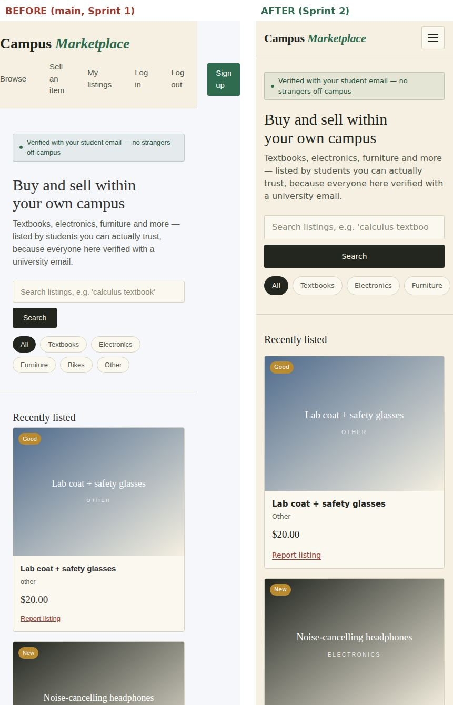
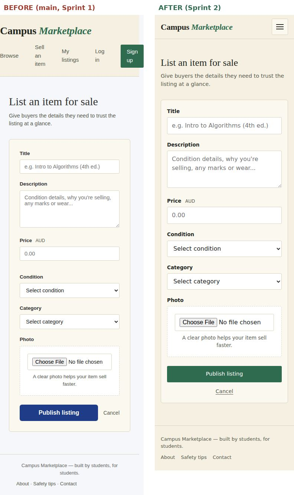
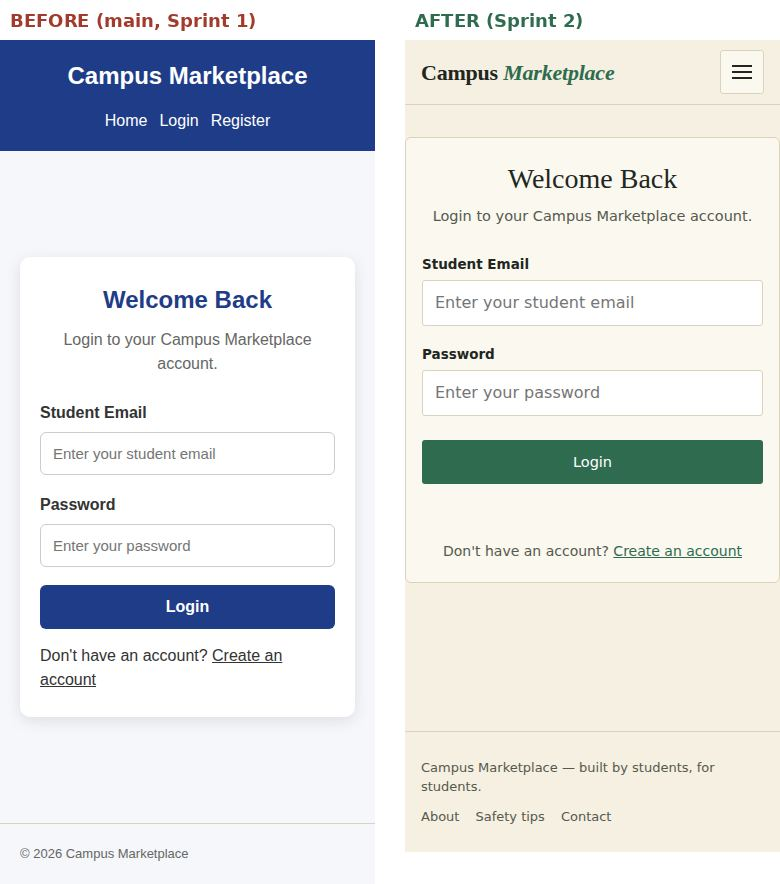
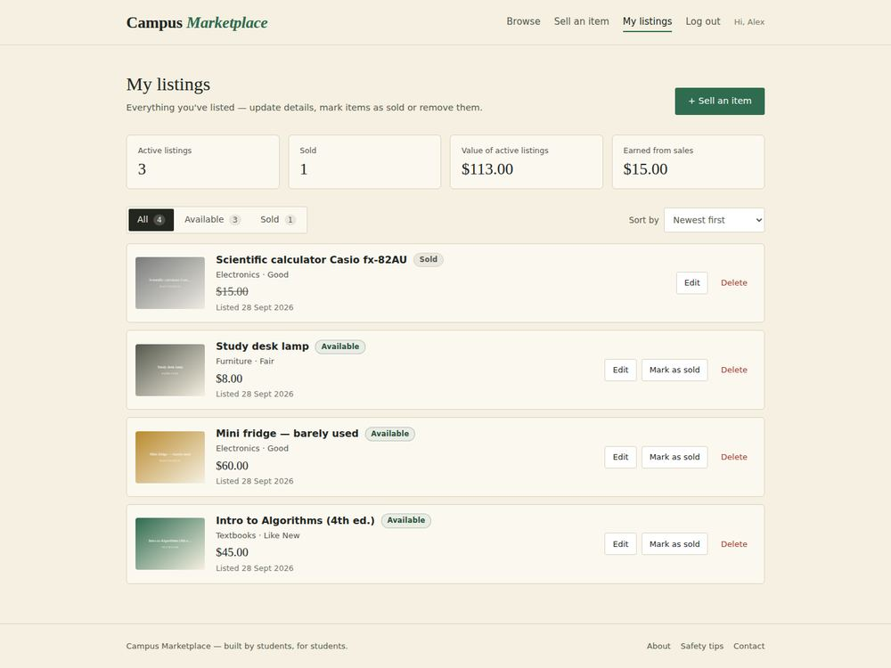
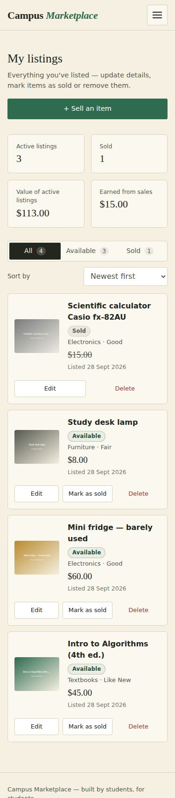

# UI Test Report: Cross-Device Layout, Navigation and Interaction

**Project:** Campus Marketplace (SIT725 Group 7)
**Sprint:** 2
**Trello card:** Manual UI testing across different screens [4] (Krushal)
**Tester:** Krushal Prajapati
**Related PRs:** UI bug fixes & responsive layout · Standardise buttons & navigation · FR-11 My Listings · CSS transitions & hover effects

---

## 1. Scope

This report checks every page of the frontend at three screen sizes, before and after the Sprint 2 UI work. It follows up on the Sprint 1 UI responsiveness testing (Surya), which found three mobile layout issues: cramped navigation, a cut-off trust message, and search elements running off the screen.

| Page | Logged out | Logged in |
|---|---|---|
| Homepage (`index.html`) | ✅ | ✅ |
| Login (`login.html`) | ✅ | – |
| Register (`register.html`) | ✅ | – |
| Create listing (`create-listing.html`) | – | ✅ |
| **My listings (`my-listings.html`, FR-11)** | redirects to login | ✅ |
| Edit listing (`edit-listing.html`) | – | ✅ |
| Report listing (`report-listing.html`) | – | ✅ |

### Viewports

| Name | Size | Represents |
|---|---|---|
| Mobile | 375 × 812 | iPhone 12–15 / most Android phones |
| Tablet | 768 × 1024 | iPad portrait |
| Desktop | 1440 × 900 | Laptop / desktop |

### Method

1. **Guided manual walkthrough** of each test case below (section 3).
2. **Automated layout capture** to keep the checks repeatable: every page × viewport was opened in Chromium 141 (Playwright 1.56 device emulation) with the seeded demo data (`npm run seed`). For each one I recorded:
   - horizontal overflow (`scrollWidth − innerWidth`)
   - elements positioned outside the viewport
   - whether the mobile menu button is shown
   - JavaScript errors

   A full-page screenshot was saved each time (section 6).
3. The **same checks were run on `main` before the changes**, to measure what was fixed.

---

## 2. Results summary

| | Before (main, Sprint 1) | After (Sprint 2) |
|---|---|---|
| Page × viewport combinations tested | 21 | **24** (+ My listings) |
| Pages with horizontal scrolling at 375px | **5** (homepage 81px, 3 form pages 12px) | **0** |
| Elements off-screen at 375px | 2 per affected page | **0** |
| Mobile hamburger menu | ✗ (nav wrapped onto 2–3 lines) | ✅ all pages |
| Same header on every page | ✗ (login/register used a different blue header) | ✅ |
| JavaScript errors | 0 | 0 |

**24 / 24 page-viewport combinations pass** with no overflow, no off-screen elements and no JS errors.

---

## 3. Test cases

| ID | Scenario | Steps | Expected | 375 | 768 | 1440 |
|---|---|---|---|---|---|---|
| UI-01 | No sideways scrolling | Open each page, try to scroll horizontally | Page never scrolls sideways | ✅ | ✅ | ✅ |
| UI-02 | Mobile navigation | Tap ☰ → tap a link / press Esc | Menu opens as a full-width list, closes on link or Esc; icon becomes ✕ | ✅ | n/a | n/a |
| UI-03 | Desktop navigation | Hover links, check current page | Underline animates in; current page keeps a green underline | n/a | ✅ | ✅ |
| UI-04 | Auth-aware nav (logged out) | Clear storage, load any page | Shows Browse, Sell, Log in, Sign up — not My listings / Log out | ✅ | ✅ | ✅ |
| UI-05 | Auth-aware nav (logged in) | Log in, load any page | Shows My listings, Log out, “Hi, name” — not Log in / Sign up | ✅ | ✅ | ✅ |
| UI-06 | Log out works everywhere | Click Log out on each page | Token cleared, sent to login | ✅ | ✅ | ✅ |
| UI-07 | Expired token | Put an expired JWT in localStorage, reload | Treated as logged out; token removed | ✅ | ✅ | ✅ |
| UI-08 | Search row | Homepage search at each size | Input + button stay on screen (button stacks under 520px) | ✅ | ✅ | ✅ |
| UI-09 | Category chips | Homepage at 375px | Chips scroll sideways in one row instead of wrapping | ✅ | ✅ | ✅ |
| UI-10 | Trust note | Homepage | Full message visible, wraps if needed | ✅ | ✅ | ✅ |
| UI-11 | Listing grid | Homepage | 1 column (375) → 2–3 (768) → 4 (1440), no overflow | ✅ | ✅ | ✅ |
| UI-12 | Buttons consistent | Compare buttons across pages | Same green primary / outlined secondary / red danger style everywhere | ✅ | ✅ | ✅ |
| UI-13 | Touch targets | Measure buttons, chips, tabs & inputs | ≥ 44px tall on touch screens (compact 36px controls only for mouse/trackpad) | ✅ | ✅ | ✅ |
| UI-14 | Forms on phones | Focus inputs on 375px | Fields full-width, 16px text (no iOS zoom), buttons full width | ✅ | ✅ | ✅ |
| UI-15 | My listings layout | Open dashboard | Stats 2×2 on mobile / 4 across on desktop; rows become cards on mobile | ✅ | ✅ | ✅ |
| UI-16 | My listings actions | Mark as sold → confirm dialog; Delete → confirm dialog | Dialog fits screen, buttons reachable, toast shows result | ✅ | ✅ | ✅ |
| UI-17 | Toasts | Publish a listing | Toast appears bottom-right (bottom full-width on mobile), auto-hides | ✅ | ✅ | ✅ |
| UI-18 | Hover effects | Hover cards/buttons | Cards lift 3px with shadow; buttons lift 1px; press shrinks | n/a | ✅ | ✅ |
| UI-19 | Reduced motion | OS setting “Reduce motion” on | No lift/zoom/slide animations | ✅ | ✅ | ✅ |
| UI-20 | Keyboard only | Tab through each page | Skip link first; visible focus ring on every control; Esc closes menu/dialog | ✅ | ✅ | ✅ |

---

## 4. Defects found and fixed

| ID | Found in | Defect | Severity | Fix | PR |
|---|---|---|---|---|---|
| BUG-01 | Homepage @375 | Page scrolled sideways by **81px** (nav + search row wider than screen) | High | Hamburger nav; search input `min-width: 0`; search button stacks on phones | UI bug fixes |
| BUG-02 | Create / Edit / Report @375 | 12px sideways scroll from the nav row | Medium | Same responsive header on every page | UI bug fixes |
| BUG-03 | All pages @375 | Nav links wrapped onto 2–3 cramped lines (“Sell / an / item”); double spacing from `gap` **and** `margin-left` | High | Single `gap`; collapses to hamburger ≤760px | UI bug fixes |
| BUG-04 | Homepage @375 | Trust message cut off (Sprint 1 finding) | Medium | `max-width: 100%` so it wraps | UI bug fixes |
| BUG-05 | Create / Edit / Report | A second stylesheet had been pasted onto the end of `style.css`: it reset all margins, forced Arial, grey page background, and made every `.btn-primary` a full-width blue button | High | Merged into one organised stylesheet using the site’s design tokens | UI bug fixes |
| BUG-06 | Login / Register | Different blue header, no Sell / My listings links | Medium | Shared header and footer on all pages | Standardise nav |
| BUG-07 | All pages | “Log in” and “Log out” both shown at the same time, whether logged in or not | Medium | Auth-aware nav (`nav.js` + `data-auth`) | Standardise nav |
| BUG-08 | Pages except homepage | Log out link missing / did nothing | Medium | `[data-action="logout"]` wired on every page via `logout.js` | Standardise nav |
| BUG-09 | Homepage | Four fake hard-coded listings flashed before real data loaded (and stayed if the API failed) | Low | “Loading listings…” state | Standardise nav |
| BUG-10 | Homepage | After “Mark as sold”, the category/search filter reset to All | Low | Re-runs the active filter | Standardise nav |
| BUG-11 | Listing cards | Edit / Mark sold / Report styled inline in 3 different colours and sizes | Low | Shared `.card-actions` + button classes | Standardise nav |
| BUG-12 | 761–900px, logged in | Long first names in “Hi, name” could squeeze the menu onto two lines | Low | Greeting hidden in that range | This PR |
| BUG-13 | Forms on iPhone | Inputs at 14.5–15px make iOS Safari zoom in on focus | Medium | Form fields are 16px on phones | This PR |
| BUG-14 | Touch screens | Compact buttons, category chips and dashboard tabs were 36px, below the 44px recommended tap size | Low | Grow to 44px under `pointer: coarse` | This PR |

### Before / after evidence (375px)

**Homepage (BUG-01, 03, 04, 09)**


**Create listing (BUG-02, 05)**


**Login (BUG-05, 06)**


---

## 5. Accessibility checks

| Check | Result |
|---|---|
| Skip-to-content link is the first thing reached with Tab | ✅ |
| Visible focus ring on every link, button and field (`:focus-visible`) | ✅ |
| Hamburger button has `aria-expanded`, `aria-controls` and a label that changes (Open/Close menu) | ✅ |
| Current page link marked with `aria-current="page"` | ✅ |
| Listing grid, dashboard and toasts use `aria-live` so updates are announced | ✅ |
| Confirmation uses native `<dialog>` (focus trapped, Esc closes) | ✅ |
| Animations disabled with `prefers-reduced-motion: reduce` | ✅ |
| Colour is never the only indicator (Sold badge has text, sold price struck through) | ✅ |

---

## 6. Screenshots (after)

| Page | Mobile 375 | Tablet 768 | Desktop 1440 |
|---|---|---|---|
| Homepage | [view](screenshots/home-375.jpg) | [view](screenshots/home-768.jpg) | [view](screenshots/home-1440.jpg) |
| Homepage (logged in) | [view](screenshots/home-logged-in-375.jpg) | [view](screenshots/home-logged-in-768.jpg) | [view](screenshots/home-logged-in-1440.jpg) |
| Login | [view](screenshots/login-375.jpg) | [view](screenshots/login-768.jpg) | [view](screenshots/login-1440.jpg) |
| Register | [view](screenshots/register-375.jpg) | [view](screenshots/register-768.jpg) | [view](screenshots/register-1440.jpg) |
| Create listing | [view](screenshots/create-listing-375.jpg) | [view](screenshots/create-listing-768.jpg) | [view](screenshots/create-listing-1440.jpg) |
| **My listings (FR-11)** | [view](screenshots/my-listings-375.jpg) | [view](screenshots/my-listings-768.jpg) | [view](screenshots/my-listings-1440.jpg) |
| Edit listing | [view](screenshots/edit-listing-375.jpg) | [view](screenshots/edit-listing-768.jpg) | [view](screenshots/edit-listing-1440.jpg) |
| Report listing | [view](screenshots/report-listing-375.jpg) | [view](screenshots/report-listing-768.jpg) | [view](screenshots/report-listing-1440.jpg) |

<p>
  
  
</p>

---

## 7. Real-browser / real-device checks

Device emulation doesn’t cover browser-specific rendering, so these were also checked by hand on real browsers:

| Browser / device | Tester | Date | Result | Notes |
|---|---|---|---|---|
| Chrome (macOS) | Krushal | | | |
| Safari (macOS) | Krushal | | | |
| Safari (iPhone) | Krushal | | | |
| Firefox (macOS / Windows) | | | | |
| Edge (Windows) | | | | |

---

## 8. How to repeat these tests

```bash
npm run setup && npm run seed && npm start      # http://localhost:3000
```

1. Log in as `alex.demo@campus.test` / `Password123!` (owns 4 listings, 1 sold).
2. In Chrome DevTools, toggle the device toolbar (`Cmd/Ctrl + Shift + M`) and set the width to 375, 768 and 1440.
3. Work through the test cases in section 3.
